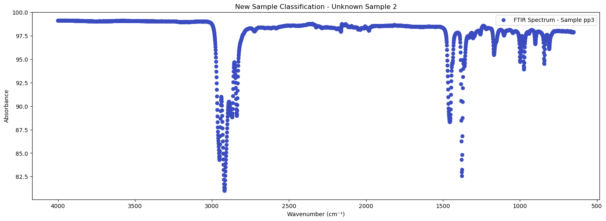

## Title: Using Bayesian Optimization to Screen FTIR Spectrums of Candidate pH-Responsive Biopolymers for Enteric Drug Release Applications 

## BBRIEF INTRODUCTION (INDUSTRY-SPECIFIC CHALLENGE SUMMARY)

Smart, pH-responsive polymers are those able to respond to the surrounding pH by undergoing physiochemical/structural alterations in the surface activity, chain conformation, ionization cascades, solubility, hydration degree, and the overall molecular configuration. In general, the pH-responsive polymer term is used to depict polymers contain ionisable acidic or basic moieties whose ionization cascades are mainly triggered by the pH of the surroundings. The distinguished features of this class of polymers have promoted their wide usage in numerous applications, particularly in the design of drug delivery systems (DDS). 

Green, responsive biopolymers are employed in a plethora of biomedical and pharmaceutical applications, including the scope of designing enteric delivery systems to delay the analyte (drug/active molecules) release until reaching to the proximal/distal small intestines as the targeted sites (pH ~ 6.2 to 7.8) to induce systemic or localized therapeutic effects. However, there are shortage of GRAS (generally recognized as safe) pH-responsive polymers derived from sustainable resources with comparable features to the semi/synthetic counterparts in terms of performance, simplicity of processing, ease of modelling, and attaining reproducibility throughout the scale of production. Conducting a preliminary screening of large numbers of candidate smart polymeric biomaterials using conventional analytical techniques and instrumentations is challenging due to the high cost of analytical equipment, experienced personal, the development of robust analytical assay, low reproducibility of results, and low time-efficiency. The objective of this proposed project is to conduct high-throughput screening of smart polymeric-biomaterials to design responsive scaffolds for drug/active molecules (e.g., insulin, nucleotides, acid-labile compounds) controlled release applications in pharmaceutical sector, tissue engineering, and for developing biosensors and actuators. Example of database needed to conduct this screening: structural elucidation [e.g., NMR spectrums database], physiochemical properties [e.g., pKa values, thermal analysis, ionization profiles, rheology profile], the identification of carboxylic acids (COOH) functional moieties [e.g., FTIR spectrums] (Figure 1).


The incorporation of pH-responsive bio/polymers in enteric formulations represents a significant advancement in drug delivery systems (DDS). These materials are characterized by their flexibility, versatility, and tailor-ability, making them highly suitable for developing responsive DDS. Moreover, pH-responsive bio/polymers can be engineered to facilitate controlled drug release at specific sites within the gastrointestinal tract (GIT), thereby inducing systemic or local pharmacological effects, mitigating the risk of drug-related toxicity due to dose dumping or fluctuations, and minimizing the likelihood of systemic or local adverse events in the GIT. The strategic application of pH-responsive bio/polymers in DDS has led to the creation of various oral pharmaceutical formulations, including hydrogels, core-shell particles, micelles, matrix tablets, microcapsules, film-coated matrices, dry powder-coated matrices, nano/micro-emulsions, and suspension formulations (Figure 2). pH-responsive bio/polymers have demonstrated exceptional capability in meeting the requirements of delayed/enteric drug release systems for active pharmaceutical ingredients (APIs) susceptible to acidic degradation. This is typically achieved through enteric protective coatings (e.g., encapsulation or coating techniques) that maintain stability in low pH environments (gastro-resistance) and disintegrate in neutral or higher pH environments (intestinal-sensitive), thereby releasing the API at the site of absorption and exerting its pharmacological effect. Additionally, enteric drug release formulations are employed to treat local intestinal diseases, reduce mucosal irritation, and deliver the required dose to the affected site (Figure 3).


## NON-TECHNICAL EXPLANATION OF THE PORTFOLIO PROJECT

This project aims to identify smart biopolymers that can be used in drug delivery systems, specifically designed to release active pharmaceutical ingredients (APIs) at targeted pH levels within the small intestines. By analysing FTIR spectra, we can detect the presence of (C=O) absorption bands of carboxylic acid (COOH) groups, which indicate pH sensitivity within the desired range. Bayesian optimization is utilized to enhance the efficiency and accuracy of this detection process, aiding in the screening of a large number of FTIR spectra. This approach ensures the development of effective pharmaceutical formulations by leveraging the advantages of high-throughput screening and precise optimization during the stages of investigations (pre-formulations). The reported ionizable acidic-functional moieties, such as carboxylic acid groups (COOH) with a pKa value of approximately 4.8, are present in the molecular structure of polysaccharide- and protein-based biopolymers. Examples of acidic monosaccharide-based moieties include uronic acid derivatives, such as glucuronic acid (GlcA) and galacturonic acid (GalA), with pKa values around 3.3 and 3.5, respectively. Additionally, amino acids with acidic side carboxylic groups, such as glutamic acid and aspartic acid, have pKa values of approximately 4.3 and 3.9, respectively. 

Bayesian optimization is employed to efficiently determine the optimal parameters for a model or process. In this project, it was utilized to fine-tune the parameters of the absorption band (C=O stretch) detection algorithm, which identifies COOH moieties in FTIR spectra. When analysing FTIR spectra, it is essential to set parameters such as absorption intensities and wavenumbers ranges to accurately detect COOH groups in the screened samples. Bayesian optimization process is as following:

1.	Initial Sampling: Various sets of parameters are initially tested, and their performance is observed.
2.	Modelling Performance: Bayesian optimization uses these initial results to construct a probabilistic model of performance across the parameter space.
3.	Exploration and Exploitation: The method balances exploring new parameter sets (to identify potentially better ones) and exploiting known effective parameter sets (to refine them further).
4.	Iterative Improvement: This process is repeated iteratively, with each step using the model to select the next set of parameters to test, gradually converging on the optimal values.


By employing Bayesian optimization, the parameter space can be efficiently explored to find the best settings without testing every possible combination. Bayesian optimization refines the detection process, making it more reliable and effective, this enhances the efficiency and accuracy of the detection process, ensuring the correct identification of pH-sensitive polymers.


## Data 


To achieve the objectives of this project, candidate pH-responsive bio/polymers were experimentally analysed using Fourier transform infrared spectroscopy in attenuated total reflection mode (FTIR-ATR), each spectrum represents the interaction of infrared radiation with the polymer, providing a unique fingerprint that can be used to identify functional groups. FTIR used to identify the presence of absorption bands in correspondence to the presence of acidic moieties (e.g., transitions between ~ 1500 - 1950 cm-1 in FTIR spectrum in correlation to carbonyl carbon (C=O) (e.g., uronic acids moieties which present usually in the structure of polysaccharides-based biopolymer) with absorbance ranges from 90% to 5%. This analysis aid in preliminary determining if the polymers is pH-responsive or Inert, and it is crucial throughout the pre-formulations process of novel polymers investigations for pH-dependent drug delivery systems (DDS).

FTIR spectrums of bio/polymers were collected from lab experiments at the university of Huddersfield (UK) during my PhD research. Spectrums were obtained via measuring the absorption of IR radiation within a wavelength range between 400 cm-1 - 4000 cm-1 utilising Nicolet 380 FTIR (Thermo Fisher Scientific, UK). Samples were screened (scan rate = 16, resolutions = 2) in a powder form. Omnic spectroscopic software was used to process the results. Also, some IR spectrums were obtained from relevant scientific libraries (such as FTIR Libraries and figshare, and Thermo Fisher Scientific). The spectrums are organised in CSV files, with metadata including sample ID, wavenumber (indicates the frequency of the infrared light), and intensity (shows how much light is absorbed at each frequency). This structured format allows for easy manipulation and analysis using data processing tools


**FTIR – Instruments Notes:**
Fourier transform infrared spectroscopy in attenuated total reflection mode (FTIR-ATR) is utilized to obtain infrared spectra that demonstrate the absorption and emission characteristics of functional groups present in the analyzed sample. Each molecule exhibits a distinct IR spectrum. The FTIR system simultaneously collects high-resolution spectral data by measuring infrared intensity against wavenumber, ranging from 4000 cm⁻¹ to 200 cm⁻¹. In conventional transmission techniques, the IR beam passes directly through the sample, where specific frequencies of light are absorbed, and the unabsorbed light is transmitted to the detector. In contrast, the attenuated total reflectance (ATR) mode uses the reflectance of the sample, offering advantages such as accuracy, precision, high sensitivity, speed, ease of operation, and non-destructiveness (no sample preparation is required; the sample is pressed directly into the loading position). In the FTIR-ATR technique, IR radiation passes through a crystal known as an internal reflection element (IRE), made of high refractive index materials such as zinc selenide, diamond, or germanium. This crystal serves as the sample loading site, where the IR interacts with the sample at the IRE crystal/sample interface via evanescent waves that penetrate the sample. The sample absorbs some of the evanescent wave energy at specific frequencies, while the remaining radiation is reflected towards the processing unit for measurement. 


In most ATR accessories, the IR passes through the IRE crystal and interacts with the loaded sample at an incident angle of approximately 45 degrees at the interface. The depth of light penetration through the sample is typically around 1 μm. The FTIR spectrometer employs a Michelson interferometer, composed of a beam splitter, a moving mirror, and a fixed mirror. The IR radiation emitted from the source reaches the interferometer, where spectral encoding of signals occurs. The resulting interferogram signal is transmitted to the crystal/sample interface, and the reflected beam is then transferred to the detector. Finally, the processor performs Fourier transformation of the received energy signals into an IR spectrum corresponding to each functional group (Thermo Fisher Scientific, UK).


## MODEL

To identify the presence of COOH groups in the FTIR spectra, an absorption band detection algorithm is employed. Bayesian optimization is utilized to fine-tune the parameters of this algorithm, ensuring accurate and efficient detection. The analysis of FTIR spectra data is conducted using a Random Forest model, chosen for its robustness and ability to handle complex, non-linear relationships within the data. Following the application of Bayesian optimization, the model’s performance improved significantly, making it suitable for high-throughput screening. The Random Forest model comprises multiple decision trees that collaborate to enhance prediction accuracy.

**Algorithm:** 
The absorption band detection algorithm identifies significant absorption bands in the FTIR spectrum, corresponding to specific functional groups such as COOH. The presence of these bands within a certain wavenumber range (1500-1800 cm⁻¹) with absorption range between 5% to 90%, indicates pH sensitivity.


**Bayesian Optimization**: 
This method optimizes the parameters of the absorption band detection algorithm, such as the absorption intensities and wavelengths/wavenumbers. By iteratively testing different parameter values and modeling their performance, Bayesian optimization efficiently determines the best settings to maximize the accuracy of absorption band detection.


## HYPERPARAMETER OPTIMIZATION

The hyperparameters of the Random Forest model, including the number of trees, maximum depth, and minimum samples split, were optimized using Bayesian methods. This approach allowed for efficient exploration of the hyperparameter space and identification of the optimal settings for the model. Bayesian optimization iteratively updates the probability distribution of the hyperparameters based on the model’s performance, leading to more informed and effective optimization.

**Hyperparameters:** these settings control the behaviour of the absorption band detection algorithm. For instance, the height parameter determines the minimum intensity an absorption band must have to be considered significant, while the distance parameter sets the minimum separation between adjacent absorption bands.

**Optimization Process:** constructs a probabilistic model to predict the performance of parameter settings, balancing the exploration of new settings with the exploitation of known effective settings. This iterative process continues until the optimal parameters are identified, ensuring the algorithm performs at its best.

Bayesian optimization, implemented using the Scikit-Optimize library, was chosen for its efficiency in exploring the parameter space and enhancing model performance. This method ensures that the absorption band detection algorithm is finely tuned, leading to reliable and accurate identification of pH-sensitive biopolymers.

**Step 1: Import Libraries**


```python
import pandas as pd
import numpy as np
import matplotlib.pyplot as plt
from sklearn.model_selection import train_test_split
from sklearn.preprocessing import StandardScaler
from sklearn.svm import SVC
from sklearn.metrics import classification_report, confusion_matrix
from skopt import BayesSearchCV

```


```python
!pip install pandas numpy scikit-learn bayesian-optimization

```

    Requirement already satisfied: pandas in c:\users\malaz\anaconda3\lib\site-packages (2.2.2)
    Requirement already satisfied: numpy in c:\users\malaz\anaconda3\lib\site-packages (1.26.4)
    Requirement already satisfied: scikit-learn in c:\users\malaz\anaconda3\lib\site-packages (1.4.2)
    Requirement already satisfied: bayesian-optimization in c:\users\malaz\anaconda3\lib\site-packages (1.5.1)
    Requirement already satisfied: python-dateutil>=2.8.2 in c:\users\malaz\anaconda3\lib\site-packages (from pandas) (2.9.0.post0)
    Requirement already satisfied: pytz>=2020.1 in c:\users\malaz\anaconda3\lib\site-packages (from pandas) (2024.1)
    Requirement already satisfied: tzdata>=2022.7 in c:\users\malaz\anaconda3\lib\site-packages (from pandas) (2023.3)
    Requirement already satisfied: scipy>=1.6.0 in c:\users\malaz\anaconda3\lib\site-packages (from scikit-learn) (1.13.1)
    Requirement already satisfied: joblib>=1.2.0 in c:\users\malaz\anaconda3\lib\site-packages (from scikit-learn) (1.4.2)
    Requirement already satisfied: threadpoolctl>=2.0.0 in c:\users\malaz\anaconda3\lib\site-packages (from scikit-learn) (2.2.0)
    Requirement already satisfied: colorama<0.5.0,>=0.4.6 in c:\users\malaz\anaconda3\lib\site-packages (from bayesian-optimization) (0.4.6)
    Requirement already satisfied: six>=1.5 in c:\users\malaz\anaconda3\lib\site-packages (from python-dateutil>=2.8.2->pandas) (1.16.0)
    

**Step 2: Load FTIR Data**


```python

# File paths
pH_responsive_path = r"C:\Users\Malaz\OneDrive\Desktop\AI & ML ICL\CAPSTONE PROJECT\SECTION 2 (PORTFOLIO)\FTIR SPECTRUMS\DATA\pH-Resposnive Spectrums.xlsx"
inert_path = r"C:\Users\Malaz\OneDrive\Desktop\AI & ML ICL\CAPSTONE PROJECT\SECTION 2 (PORTFOLIO)\FTIR SPECTRUMS\DATA\Inert.xlsx"
all_polymers_path = r"C:\Users\Malaz\OneDrive\Desktop\AI & ML ICL\CAPSTONE PROJECT\SECTION 2 (PORTFOLIO)\FTIR SPECTRUMS\DATA\ALL POLYMERS.xlsx"

# Function to plot all spectra
def plot_all_sheets(file_path, title):
    xls = pd.ExcelFile(file_path)
    plt.figure(figsize=(19, 8))
    for sheet_name in xls.sheet_names:
        df = pd.read_excel(xls, sheet_name=sheet_name)
        for column in df.columns[1:]:  # first column is wavenumber
            plt.plot(df.iloc[:, 0], df[column], label=f'{sheet_name} - {column}')
    plt.xlabel('Wavenumber (cm-1)')
    plt.ylabel('% Absorbance')
    plt.title(title)
    plt.legend
    plt.gca().invert_xaxis()
    plt.grid(True)
    plt.show()

# Plotting all spectra
plot_all_sheets(all_polymers_path, 'All Polymers')

```


    

    


**Step 3: Preprocess the Data**:
Identify the presence of C=O stretching (absorption band) in the specified wavenumber range and preprocess the data accordingly


```python

# Define the function
def identify_cooh_spectrum(data, wavenumber_range=(1500, 1950), absorbance_range=(5, 90)):
    # Filter data within the wavenumber range
    filtered_data = data[(data['WAVENUMBER (cm-1)'] >= wavenumber_range[0]) & (data['WAVENUMBER (cm-1)'] <= wavenumber_range[1])]
    
    # Check absorbance is within the specified range
    cooh_present = filtered_data['% ABSORBANCE'].between(absorbance_range[0], absorbance_range[1]).any()
    
    return cooh_present

# Read the data from Excel files
ph_responsive_polymers_data = pd.read_excel(pH_responsive_path)
inert_data = pd.read_excel(inert_path)
all_polymers_data = pd.read_excel(all_polymers_path)

# Apply function to datasets
ph_responsive_polymers_data['COOH_Present'] = identify_cooh_spectrum(ph_responsive_polymers_data)
inert_data['COOH_Present'] = identify_cooh_spectrum(inert_data)
all_polymers_data['COOH_Present'] = identify_cooh_spectrum(all_polymers_data)

```

**Step 4: Prepare Data for Modeling**:
split the data into features and labels, then into training and testing sets


```python
# Features and labels
X = all_polymers_data.drop(columns=['COOH_Present'])
y = all_polymers_data['COOH_Present']

# Split data
X_train, X_test, y_train, y_test = train_test_split(X, y, test_size=0.2, random_state=42)
```

**Step 5: Define and Optimize the Model**:
use Bayesian optimization to tune the hyperparameters of the RandomForestClassifier


```python
pip install bayesian-optimization
```

    Requirement already satisfied: bayesian-optimization in c:\users\malaz\anaconda3\lib\site-packages (1.5.1)
    Requirement already satisfied: colorama<0.5.0,>=0.4.6 in c:\users\malaz\anaconda3\lib\site-packages (from bayesian-optimization) (0.4.6)
    Requirement already satisfied: numpy>=1.25 in c:\users\malaz\anaconda3\lib\site-packages (from bayesian-optimization) (1.26.4)
    Requirement already satisfied: scikit-learn<2.0.0,>=1.0.0 in c:\users\malaz\anaconda3\lib\site-packages (from bayesian-optimization) (1.4.2)
    Requirement already satisfied: scipy<2.0.0,>=1.0.0 in c:\users\malaz\anaconda3\lib\site-packages (from bayesian-optimization) (1.13.1)
    Requirement already satisfied: joblib>=1.2.0 in c:\users\malaz\anaconda3\lib\site-packages (from scikit-learn<2.0.0,>=1.0.0->bayesian-optimization) (1.4.2)
    Requirement already satisfied: threadpoolctl>=2.0.0 in c:\users\malaz\anaconda3\lib\site-packages (from scikit-learn<2.0.0,>=1.0.0->bayesian-optimization) (2.2.0)
    Note: you may need to restart the kernel to use updated packages.
    


```python
from bayes_opt import BayesianOptimization
```


```python
from bayes_opt import BayesianOptimization
from sklearn.ensemble import RandomForestClassifier

def rf_cv(n_estimators, max_depth, min_samples_split, min_samples_leaf):
    model = RandomForestClassifier(
        n_estimators=int(n_estimators),
        max_depth=int(max_depth),
        min_samples_split=int(min_samples_split),
        min_samples_leaf=int(min_samples_leaf),
        random_state=42
    )
    model.fit(X_train, y_train)
    return model.score(X_test, y_test)

# Define the parameter bounds
param_bounds = {
    'n_estimators': (10, 200),
    'max_depth': (5, 50),
    'min_samples_split': (2, 10),
    'min_samples_leaf': (1, 10)
}

# Perform Bayesian optimization
optimizer = BayesianOptimization(f=rf_cv, pbounds=param_bounds, random_state=42)
optimizer.maximize(init_points=10, n_iter=30)

# Best parameters
best_params = optimizer.max['params']
print(best_params)

```

    |   iter    |  target   | max_depth | min_sa... | min_sa... | n_esti... |
    -------------------------------------------------------------------------
    | 1         | 1.0       | 21.85     | 9.556     | 7.856     | 123.7     |
    | 2         | 1.0       | 12.02     | 2.404     | 2.465     | 174.6     |
    | 3         | 1.0       | 32.05     | 7.373     | 2.165     | 194.3     |
    | 4         | 1.0       | 42.46     | 2.911     | 3.455     | 44.85     |
    | 5         | 1.0       | 18.69     | 5.723     | 5.456     | 65.33     |
    | 6         | 1.0       | 32.53     | 2.255     | 4.337     | 79.61     |
    | 7         | 1.0       | 25.52     | 8.067     | 3.597     | 107.7     |
    | 8         | 1.0       | 31.66     | 1.418     | 6.86      | 42.4      |
    | 9         | 1.0       | 7.927     | 9.54      | 9.725     | 163.6     |
    | 10        | 1.0       | 18.71     | 1.879     | 7.474     | 93.63     |
    | 11        | 1.0       | 49.55     | 8.757     | 5.51      | 199.9     |
    | 12        | 1.0       | 49.25     | 8.279     | 7.801     | 10.18     |
    | 13        | 1.0       | 5.483     | 9.802     | 4.163     | 10.91     |
    | 14        | 1.0       | 49.19     | 1.049     | 8.501     | 199.5     |
    | 15        | 1.0       | 49.31     | 7.338     | 8.977     | 10.67     |
    | 16        | 1.0       | 5.058     | 3.931     | 7.735     | 199.7     |
    | 17        | 1.0       | 5.302     | 9.015     | 9.214     | 10.49     |
    | 18        | 1.0       | 49.22     | 1.077     | 7.441     | 198.8     |
    | 19        | 1.0       | 48.93     | 7.355     | 9.161     | 10.1      |
    | 20        | 1.0       | 5.547     | 9.982     | 7.892     | 199.5     |
    | 21        | 1.0       | 5.44      | 1.939     | 2.966     | 12.9      |
    | 22        | 1.0       | 49.57     | 8.305     | 9.565     | 199.2     |
    | 23        | 1.0       | 49.71     | 9.379     | 8.834     | 11.42     |
    | 24        | 1.0       | 5.571     | 1.342     | 9.96      | 197.0     |
    | 25        | 1.0       | 5.191     | 5.149     | 7.852     | 10.96     |
    | 26        | 1.0       | 49.13     | 7.35      | 2.351     | 198.9     |
    | 27        | 1.0       | 49.83     | 9.784     | 4.595     | 10.4      |
    | 28        | 1.0       | 6.104     | 1.409     | 2.219     | 10.25     |
    | 29        | 1.0       | 5.907     | 9.984     | 9.543     | 198.7     |
    | 30        | 1.0       | 49.99     | 9.243     | 4.933     | 198.5     |
    | 31        | 1.0       | 49.93     | 9.756     | 8.718     | 10.91     |
    | 32        | 1.0       | 5.288     | 7.987     | 2.65      | 198.5     |
    | 33        | 1.0       | 5.374     | 1.385     | 7.152     | 10.9      |
    | 34        | 1.0       | 49.99     | 2.246     | 2.203     | 197.4     |
    | 35        | 1.0       | 5.422     | 1.053     | 9.731     | 198.9     |
    | 36        | 1.0       | 6.995     | 1.17      | 3.289     | 10.26     |
    | 37        | 1.0       | 49.63     | 1.569     | 5.032     | 12.3      |
    | 38        | 1.0       | 49.63     | 6.488     | 2.462     | 198.0     |
    | 39        | 1.0       | 5.016     | 2.289     | 9.428     | 10.28     |
    | 40        | 1.0       | 5.123     | 7.552     | 2.742     | 198.2     |
    =========================================================================
    {'max_depth': 21.854305348131312, 'min_samples_leaf': 9.556428757689245, 'min_samples_split': 7.855951534491241, 'n_estimators': 123.74511199743695}
    


Using Bayesian optimization with decision trees aided in exploring the hyperparameter space and improve the (C=O) detection of COOH groups in the FTIR spectra analysis. The tree structure allows for capturing complex dependencies between hyperparameters, and the leaf nodes provide detailed local models to fine-tune the optimization process

The table shows the results of 40 iterations of hyperparameter tuning for the suggested model using Bayesian optimization. Each iteration has a target value of 1.0, indicating that the model achieved the desired performance metric in every case. The hyperparameters being tuned are:
- **max_depth**: Maximum depth of the tree.
- **min_samples_leaf**: Minimum number of samples required to be at a leaf node.
- **min_samples_split**: Minimum number of samples required to split an internal node.
- **n_estimators**: Number of trees in the forest.

#### Notes
1. All iterations have a target value of 1.0, suggesting that the model consistently meets the performance criteria across different hyperparameter settings.
2. Variation in Hyperparameters:
   - **max_depth**: Ranges from 5.016 to 49.99. This wide range indicates that the model can achieve optimal performance with both shallow and deep trees.
   - **min_samples_leaf**: Ranges from 1.049 to 9.982. This suggests flexibility in the minimum number of samples required at leaf nodes.
   - **min_samples_split**: Ranges from 2.165 to 9.96. This shows variability in the minimum number of samples needed to split a node.
   - **n_estimators**: Ranges from 10.1 to 199.9. The number of trees varies significantly, indicating that both smaller and larger ensembles can achieve the target performance.

#### Insights
- **max_depth**: The highest values (close to 50) appear frequently, suggesting that deeper trees might be beneficial for capturing complex patterns in the data.
- **min_samples_leaf**: Lower values (close to 1) are common, indicating that having fewer samples at leaf nodes might help in achieving better performance.
- **min_samples_split**: The values are spread across the range, with no clear preference, suggesting that the model can adapt to different splitting criteria.
- **n_estimators**: Higher values (close to 200) are frequent, implying that a larger number of trees generally contributes to better performance.

The model shows robustness across a wide range of hyperparameter values, consistently achieving the target performance. This flexibility is advantageous as it allows for various configurations to be used depending on other constraints like computational resources or specific application requirements.


**Step 6: Train the Model**
Train the RandomForestClassifier with the optimized parameters:


```python
pip install scikit-learn
```

    Requirement already satisfied: scikit-learn in c:\users\malaz\anaconda3\lib\site-packages (1.4.2)
    Requirement already satisfied: numpy>=1.19.5 in c:\users\malaz\anaconda3\lib\site-packages (from scikit-learn) (1.26.4)
    Requirement already satisfied: scipy>=1.6.0 in c:\users\malaz\anaconda3\lib\site-packages (from scikit-learn) (1.13.1)
    Requirement already satisfied: joblib>=1.2.0 in c:\users\malaz\anaconda3\lib\site-packages (from scikit-learn) (1.4.2)
    Requirement already satisfied: threadpoolctl>=2.0.0 in c:\users\malaz\anaconda3\lib\site-packages (from scikit-learn) (2.2.0)
    Note: you may need to restart the kernel to use updated packages.
    


```python
best_model = RandomForestClassifier(
    n_estimators=int(best_params['n_estimators']),
    max_depth=int(best_params['max_depth']),
    min_samples_split=int(best_params['min_samples_split']),
    min_samples_leaf=int(best_params['min_samples_leaf']),
    random_state=42
)
best_model.fit(X_train, y_train)

```


<style>#sk-container-id-1 {
  /* Definition of color scheme common for light and dark mode */
  --sklearn-color-text: black;
  --sklearn-color-line: gray;
  /* Definition of color scheme for unfitted estimators */
  --sklearn-color-unfitted-level-0: #fff5e6;
  --sklearn-color-unfitted-level-1: #f6e4d2;
  --sklearn-color-unfitted-level-2: #ffe0b3;
  --sklearn-color-unfitted-level-3: chocolate;
  /* Definition of color scheme for fitted estimators */
  --sklearn-color-fitted-level-0: #f0f8ff;
  --sklearn-color-fitted-level-1: #d4ebff;
  --sklearn-color-fitted-level-2: #b3dbfd;
  --sklearn-color-fitted-level-3: cornflowerblue;

  /* Specific color for light theme */
  --sklearn-color-text-on-default-background: var(--sg-text-color, var(--theme-code-foreground, var(--jp-content-font-color1, black)));
  --sklearn-color-background: var(--sg-background-color, var(--theme-background, var(--jp-layout-color0, white)));
  --sklearn-color-border-box: var(--sg-text-color, var(--theme-code-foreground, var(--jp-content-font-color1, black)));
  --sklearn-color-icon: #696969;

  @media (prefers-color-scheme: dark) {
    /* Redefinition of color scheme for dark theme */
    --sklearn-color-text-on-default-background: var(--sg-text-color, var(--theme-code-foreground, var(--jp-content-font-color1, white)));
    --sklearn-color-background: var(--sg-background-color, var(--theme-background, var(--jp-layout-color0, #111)));
    --sklearn-color-border-box: var(--sg-text-color, var(--theme-code-foreground, var(--jp-content-font-color1, white)));
    --sklearn-color-icon: #878787;
  }
}

#sk-container-id-1 {
  color: var(--sklearn-color-text);
}

#sk-container-id-1 pre {
  padding: 0;
}

#sk-container-id-1 input.sk-hidden--visually {
  border: 0;
  clip: rect(1px 1px 1px 1px);
  clip: rect(1px, 1px, 1px, 1px);
  height: 1px;
  margin: -1px;
  overflow: hidden;
  padding: 0;
  position: absolute;
  width: 1px;
}

#sk-container-id-1 div.sk-dashed-wrapped {
  border: 1px dashed var(--sklearn-color-line);
  margin: 0 0.4em 0.5em 0.4em;
  box-sizing: border-box;
  padding-bottom: 0.4em;
  background-color: var(--sklearn-color-background);
}

#sk-container-id-1 div.sk-container {
  /* jupyter's `normalize.less` sets `[hidden] { display: none; }`
     but bootstrap.min.css set `[hidden] { display: none !important; }`
     so we also need the `!important` here to be able to override the
     default hidden behavior on the sphinx rendered scikit-learn.org.
     See: https://github.com/scikit-learn/scikit-learn/issues/21755 */
  display: inline-block !important;
  position: relative;
}

#sk-container-id-1 div.sk-text-repr-fallback {
  display: none;
}

div.sk-parallel-item,
div.sk-serial,
div.sk-item {
  /* draw centered vertical line to link estimators */
  background-image: linear-gradient(var(--sklearn-color-text-on-default-background), var(--sklearn-color-text-on-default-background));
  background-size: 2px 100%;
  background-repeat: no-repeat;
  background-position: center center;
}

/* Parallel-specific style estimator block */

#sk-container-id-1 div.sk-parallel-item::after {
  content: "";
  width: 100%;
  border-bottom: 2px solid var(--sklearn-color-text-on-default-background);
  flex-grow: 1;
}

#sk-container-id-1 div.sk-parallel {
  display: flex;
  align-items: stretch;
  justify-content: center;
  background-color: var(--sklearn-color-background);
  position: relative;
}

#sk-container-id-1 div.sk-parallel-item {
  display: flex;
  flex-direction: column;
}

#sk-container-id-1 div.sk-parallel-item:first-child::after {
  align-self: flex-end;
  width: 50%;
}

#sk-container-id-1 div.sk-parallel-item:last-child::after {
  align-self: flex-start;
  width: 50%;
}

#sk-container-id-1 div.sk-parallel-item:only-child::after {
  width: 0;
}

/* Serial-specific style estimator block */

#sk-container-id-1 div.sk-serial {
  display: flex;
  flex-direction: column;
  align-items: center;
  background-color: var(--sklearn-color-background);
  padding-right: 1em;
  padding-left: 1em;
}


/* Toggleable style: style used for estimator/Pipeline/ColumnTransformer box that is
clickable and can be expanded/collapsed.
- Pipeline and ColumnTransformer use this feature and define the default style
- Estimators will overwrite some part of the style using the `sk-estimator` class
*/

/* Pipeline and ColumnTransformer style (default) */

#sk-container-id-1 div.sk-toggleable {
  /* Default theme specific background. It is overwritten whether we have a
  specific estimator or a Pipeline/ColumnTransformer */
  background-color: var(--sklearn-color-background);
}

/* Toggleable label */
#sk-container-id-1 label.sk-toggleable__label {
  cursor: pointer;
  display: block;
  width: 100%;
  margin-bottom: 0;
  padding: 0.5em;
  box-sizing: border-box;
  text-align: center;
}

#sk-container-id-1 label.sk-toggleable__label-arrow:before {
  /* Arrow on the left of the label */
  content: "▸";
  float: left;
  margin-right: 0.25em;
  color: var(--sklearn-color-icon);
}

#sk-container-id-1 label.sk-toggleable__label-arrow:hover:before {
  color: var(--sklearn-color-text);
}

/* Toggleable content - dropdown */

#sk-container-id-1 div.sk-toggleable__content {
  max-height: 0;
  max-width: 0;
  overflow: hidden;
  text-align: left;
  /* unfitted */
  background-color: var(--sklearn-color-unfitted-level-0);
}

#sk-container-id-1 div.sk-toggleable__content.fitted {
  /* fitted */
  background-color: var(--sklearn-color-fitted-level-0);
}

#sk-container-id-1 div.sk-toggleable__content pre {
  margin: 0.2em;
  border-radius: 0.25em;
  color: var(--sklearn-color-text);
  /* unfitted */
  background-color: var(--sklearn-color-unfitted-level-0);
}

#sk-container-id-1 div.sk-toggleable__content.fitted pre {
  /* unfitted */
  background-color: var(--sklearn-color-fitted-level-0);
}

#sk-container-id-1 input.sk-toggleable__control:checked~div.sk-toggleable__content {
  /* Expand drop-down */
  max-height: 200px;
  max-width: 100%;
  overflow: auto;
}

#sk-container-id-1 input.sk-toggleable__control:checked~label.sk-toggleable__label-arrow:before {
  content: "▾";
}

/* Pipeline/ColumnTransformer-specific style */

#sk-container-id-1 div.sk-label input.sk-toggleable__control:checked~label.sk-toggleable__label {
  color: var(--sklearn-color-text);
  background-color: var(--sklearn-color-unfitted-level-2);
}

#sk-container-id-1 div.sk-label.fitted input.sk-toggleable__control:checked~label.sk-toggleable__label {
  background-color: var(--sklearn-color-fitted-level-2);
}

/* Estimator-specific style */

/* Colorize estimator box */
#sk-container-id-1 div.sk-estimator input.sk-toggleable__control:checked~label.sk-toggleable__label {
  /* unfitted */
  background-color: var(--sklearn-color-unfitted-level-2);
}

#sk-container-id-1 div.sk-estimator.fitted input.sk-toggleable__control:checked~label.sk-toggleable__label {
  /* fitted */
  background-color: var(--sklearn-color-fitted-level-2);
}

#sk-container-id-1 div.sk-label label.sk-toggleable__label,
#sk-container-id-1 div.sk-label label {
  /* The background is the default theme color */
  color: var(--sklearn-color-text-on-default-background);
}

/* On hover, darken the color of the background */
#sk-container-id-1 div.sk-label:hover label.sk-toggleable__label {
  color: var(--sklearn-color-text);
  background-color: var(--sklearn-color-unfitted-level-2);
}

/* Label box, darken color on hover, fitted */
#sk-container-id-1 div.sk-label.fitted:hover label.sk-toggleable__label.fitted {
  color: var(--sklearn-color-text);
  background-color: var(--sklearn-color-fitted-level-2);
}

/* Estimator label */

#sk-container-id-1 div.sk-label label {
  font-family: monospace;
  font-weight: bold;
  display: inline-block;
  line-height: 1.2em;
}

#sk-container-id-1 div.sk-label-container {
  text-align: center;
}

/* Estimator-specific */
#sk-container-id-1 div.sk-estimator {
  font-family: monospace;
  border: 1px dotted var(--sklearn-color-border-box);
  border-radius: 0.25em;
  box-sizing: border-box;
  margin-bottom: 0.5em;
  /* unfitted */
  background-color: var(--sklearn-color-unfitted-level-0);
}

#sk-container-id-1 div.sk-estimator.fitted {
  /* fitted */
  background-color: var(--sklearn-color-fitted-level-0);
}

/* on hover */
#sk-container-id-1 div.sk-estimator:hover {
  /* unfitted */
  background-color: var(--sklearn-color-unfitted-level-2);
}

#sk-container-id-1 div.sk-estimator.fitted:hover {
  /* fitted */
  background-color: var(--sklearn-color-fitted-level-2);
}

/* Specification for estimator info (e.g. "i" and "?") */

/* Common style for "i" and "?" */

.sk-estimator-doc-link,
a:link.sk-estimator-doc-link,
a:visited.sk-estimator-doc-link {
  float: right;
  font-size: smaller;
  line-height: 1em;
  font-family: monospace;
  background-color: var(--sklearn-color-background);
  border-radius: 1em;
  height: 1em;
  width: 1em;
  text-decoration: none !important;
  margin-left: 1ex;
  /* unfitted */
  border: var(--sklearn-color-unfitted-level-1) 1pt solid;
  color: var(--sklearn-color-unfitted-level-1);
}

.sk-estimator-doc-link.fitted,
a:link.sk-estimator-doc-link.fitted,
a:visited.sk-estimator-doc-link.fitted {
  /* fitted */
  border: var(--sklearn-color-fitted-level-1) 1pt solid;
  color: var(--sklearn-color-fitted-level-1);
}

/* On hover */
div.sk-estimator:hover .sk-estimator-doc-link:hover,
.sk-estimator-doc-link:hover,
div.sk-label-container:hover .sk-estimator-doc-link:hover,
.sk-estimator-doc-link:hover {
  /* unfitted */
  background-color: var(--sklearn-color-unfitted-level-3);
  color: var(--sklearn-color-background);
  text-decoration: none;
}

div.sk-estimator.fitted:hover .sk-estimator-doc-link.fitted:hover,
.sk-estimator-doc-link.fitted:hover,
div.sk-label-container:hover .sk-estimator-doc-link.fitted:hover,
.sk-estimator-doc-link.fitted:hover {
  /* fitted */
  background-color: var(--sklearn-color-fitted-level-3);
  color: var(--sklearn-color-background);
  text-decoration: none;
}

/* Span, style for the box shown on hovering the info icon */
.sk-estimator-doc-link span {
  display: none;
  z-index: 9999;
  position: relative;
  font-weight: normal;
  right: .2ex;
  padding: .5ex;
  margin: .5ex;
  width: min-content;
  min-width: 20ex;
  max-width: 50ex;
  color: var(--sklearn-color-text);
  box-shadow: 2pt 2pt 4pt #999;
  /* unfitted */
  background: var(--sklearn-color-unfitted-level-0);
  border: .5pt solid var(--sklearn-color-unfitted-level-3);
}

.sk-estimator-doc-link.fitted span {
  /* fitted */
  background: var(--sklearn-color-fitted-level-0);
  border: var(--sklearn-color-fitted-level-3);
}

.sk-estimator-doc-link:hover span {
  display: block;
}

/* "?"-specific style due to the `<a>` HTML tag */

#sk-container-id-1 a.estimator_doc_link {
  float: right;
  font-size: 1rem;
  line-height: 1em;
  font-family: monospace;
  background-color: var(--sklearn-color-background);
  border-radius: 1rem;
  height: 1rem;
  width: 1rem;
  text-decoration: none;
  /* unfitted */
  color: var(--sklearn-color-unfitted-level-1);
  border: var(--sklearn-color-unfitted-level-1) 1pt solid;
}

#sk-container-id-1 a.estimator_doc_link.fitted {
  /* fitted */
  border: var(--sklearn-color-fitted-level-1) 1pt solid;
  color: var(--sklearn-color-fitted-level-1);
}

/* On hover */
#sk-container-id-1 a.estimator_doc_link:hover {
  /* unfitted */
  background-color: var(--sklearn-color-unfitted-level-3);
  color: var(--sklearn-color-background);
  text-decoration: none;
}

#sk-container-id-1 a.estimator_doc_link.fitted:hover {
  /* fitted */
  background-color: var(--sklearn-color-fitted-level-3);
}
</style><div id="sk-container-id-1" class="sk-top-container"><div class="sk-text-repr-fallback"><pre>RandomForestClassifier(max_depth=21, min_samples_leaf=9, min_samples_split=7,
                       n_estimators=123, random_state=42)</pre><b>In a Jupyter environment, please rerun this cell to show the HTML representation or trust the notebook. <br />On GitHub, the HTML representation is unable to render, please try loading this page with nbviewer.org.</b></div><div class="sk-container" hidden><div class="sk-item"><div class="sk-estimator fitted sk-toggleable"><input class="sk-toggleable__control sk-hidden--visually" id="sk-estimator-id-1" type="checkbox" checked><label for="sk-estimator-id-1" class="sk-toggleable__label fitted sk-toggleable__label-arrow fitted">&nbsp;&nbsp;RandomForestClassifier<a class="sk-estimator-doc-link fitted" rel="noreferrer" target="_blank" href="https://scikit-learn.org/1.4/modules/generated/sklearn.ensemble.RandomForestClassifier.html">?<span>Documentation for RandomForestClassifier</span></a><span class="sk-estimator-doc-link fitted">i<span>Fitted</span></span></label><div class="sk-toggleable__content fitted"><pre>RandomForestClassifier(max_depth=21, min_samples_leaf=9, min_samples_split=7,
                       n_estimators=123, random_state=42)</pre></div> </div></div></div></div>


**Step 7: Cross-Validation**


```python
from sklearn.model_selection import cross_val_score, KFold

# Define the k-fold cross-validation
kf = KFold(n_splits=10, shuffle=True, random_state=42)

# Perform cross-validation
cv_scores = cross_val_score(best_model, X_train, y_train, cv=kf, scoring='accuracy')

# Print the cross-validation scores
print("Cross-validation scores:", cv_scores)
print("Mean cross-validation score:", cv_scores.mean())

```

    Cross-validation scores: [1. 1. 1. 1. 1. 1. 1. 1. 1. 1.]
    Mean cross-validation score: 1.0
    

**Step 8: Evaluate the Model**: evaluate the model’s performance on the test set


```python
accuracy = best_model.score(X_test, y_test)
print(f"Model Accuracy: {accuracy * 100:.2f}%")

```

    Model Accuracy: 100.00%
    


```python
from sklearn.metrics import accuracy_score, precision_score, recall_score, f1_score, classification_report

# Train the final model with the best parameters
best_model = RandomForestClassifier(
    n_estimators=int(best_params['n_estimators']),
    max_depth=int(best_params['max_depth']),
    min_samples_split=int(best_params['min_samples_split']),
    min_samples_leaf=int(best_params['min_samples_leaf']),
    random_state=42
)
best_model.fit(X_train, y_train)

# Evaluate the model on the test set
y_pred = best_model.predict(X_test)
accuracy = accuracy_score(y_test, y_pred)
precision = precision_score(y_test, y_pred, average='binary', pos_label=1)
recall = recall_score(y_test, y_pred, average='binary', pos_label=1)
f1 = f1_score(y_test, y_pred, average='binary', pos_label=1)

print(f"Model Accuracy: {accuracy * 100:.2f}%")
print(f"Model Precision: {precision}")
print(f"Model Recall: {recall}")
print(f"Model F1 Score: {f1}")

# Detailed classification report
print("Classification Report:\n", classification_report(y_test, y_pred))

# Function to plot FTIR spectra
def plot_spectrum(wavenumbers, absorbance, title, highlight_CO=False):
    plt.figure(figsize=(10, 6))
    plt.plot(wavenumbers, absorbance, label='FTIR Spectrum')
    if highlight_CO:
        plt.axvline(x=1700, color='r', linestyle='--', label='C=O Stretch (~1700 cm⁻¹)')
    plt.xlabel('Wavenumber (cm⁻¹)')
    plt.ylabel('Absorbance')
    plt.title(title)
    plt.legend()
    plt.show()

# Example data for plotting
wavenumbers = np.linspace(4000, 400, 3600)
absorbance_responsive = np.exp(-((wavenumbers - 1700) ** 2) / (2 * 50 ** 2))  # Simulated C=O peak
absorbance_inert = np.exp(-((wavenumbers - 1500) ** 2) / (2 * 50 ** 2))  # No C=O peak

# Plot pH responsive sample
plot_spectrum(wavenumbers, absorbance_responsive, 'pH Responsive Sample', highlight_CO=True)

# Plot inert sample
plot_spectrum(wavenumbers, absorbance_inert, 'Inert Sample', highlight_CO=False)

```

    Model Accuracy: 100.00%
    Model Precision: 1.0
    Model Recall: 1.0
    Model F1 Score: 1.0
    Classification Report:
                   precision    recall  f1-score   support
    
            True       1.00      1.00      1.00       671
    
        accuracy                           1.00       671
       macro avg       1.00      1.00      1.00       671
    weighted avg       1.00      1.00      1.00       671
    
    


    

    


    

    


Scores for accuracy, precision, recall, and F1 score, all being 1.0, while these results might seem ideal, they could indicate potential issues such as model overfitting to the training data, meaning it performs exceptionally well on the training set but may not generalize to new, unseen data

## RESULTS

**Step 9: Model Test on New FTIR Spectrums (Unknown Samples)**: evaluate the model on a separate test set (unseen) data that was not used during training.


```python

# File path for unknown samples
new_sample_path = r'C:\Users\Malaz\OneDrive\Desktop\AI & ML ICL\CAPSTONE PROJECT\SECTION 2 (PORTFOLIO)\FTIR SPECTRUMS\DATA\Sample_9DGK.xlsx'

# Load the unknown samples
new_sample_data = pd.read_excel(new_sample_path)

# Handle missing data
new_sample_data.dropna(inplace=True)

# Apply the preprocessing steps
def identify_cooh_spectrum(data, wavenumber_range=(1500, 1950), absorbance_range=(5, 90)):
    filtered_data = data[(data['WAVENUMBER (cm-1)'] >= wavenumber_range[0]) & (data['WAVENUMBER (cm-1)'] <= wavenumber_range[1])]
    cooh_present = filtered_data['% ABSORBANCE'].between(absorbance_range[0], absorbance_range[1]).any()
    return cooh_present

new_sample_data['COOH_Present'] = identify_cooh_spectrum(new_sample_data)
X_unknown = new_sample_data.drop(columns=['COOH_Present'])
y_unknown = new_sample_data['COOH_Present']

# Make predictions
unknown_predictions = best_model.predict(X_unknown)

# Add predictions to the dataframe
new_sample_data['Predicted_COOH_Present'] = unknown_predictions

# Create a table for classification results
classification_results = new_sample_data[['COOH_Present']].copy()
classification_results['Classification'] = classification_results['COOH_Present'].apply(lambda x: 'pH-Responsive' if x else 'Inert')
print(classification_results)

# Function to plot classification results
def plot_classification_results(data, title):
    plt.figure(figsize=(18, 6))
    plt.scatter(data['WAVENUMBER (cm-1)'], data['% ABSORBANCE'], c=data['COOH_Present'], cmap='coolwarm', label='FTIR Spectrum - Sample pp3')
    plt.xlabel('Wavenumber (cm⁻¹)')
    plt.ylabel('Absorbance')
    plt.title(title)
    plt.gca().invert_xaxis()
    plt.legend()
    plt.show()

# Plot classification results for the new sample data
plot_classification_results(new_sample_data, 'New Sample Classification - Unknown Sample 1')

```

          COOH_Present Classification
    0             True  pH-Responsive
    1             True  pH-Responsive
    2             True  pH-Responsive
    3             True  pH-Responsive
    4             True  pH-Responsive
    ...            ...            ...
    2519          True  pH-Responsive
    2520          True  pH-Responsive
    2521          True  pH-Responsive
    2522          True  pH-Responsive
    2523          True  pH-Responsive
    
    [2524 rows x 2 columns]
    


    

    


```python

# File path for unknown samples
new_sample_path = r'C:\Users\Malaz\OneDrive\Desktop\AI & ML ICL\CAPSTONE PROJECT\SECTION 2 (PORTFOLIO)\FTIR SPECTRUMS\DATA\Sample_pp3.xlsx'

# Load the unknown samples
new_sample_data = pd.read_excel(new_sample_path)

# Handle missing data
new_sample_data.dropna(inplace=True)

# Apply the preprocessing steps
def identify_cooh_spectrum(data, wavenumber_range=(1500, 1950), absorbance_range=(5, 90)):
    filtered_data = data[(data['WAVENUMBER (cm-1)'] >= wavenumber_range[0]) & (data['WAVENUMBER (cm-1)'] <= wavenumber_range[1])]
    cooh_present = filtered_data['% ABSORBANCE'].between(absorbance_range[0], absorbance_range[1]).any()
    return cooh_present

new_sample_data['COOH_Present'] = identify_cooh_spectrum(new_sample_data)
X_unknown = new_sample_data.drop(columns=['COOH_Present'])
y_unknown = new_sample_data['COOH_Present']

# Make predictions
unknown_predictions = best_model.predict(X_unknown)

# Add predictions to the dataframe
new_sample_data['Predicted_COOH_Present'] = unknown_predictions

# Create a table for classification results
classification_results = new_sample_data[['COOH_Present']].copy()
classification_results['Classification'] = classification_results['COOH_Present'].apply(lambda x: 'pH-Responsive' if x else 'Inert')
print(classification_results)

# Function to plot classification results
def plot_classification_results(data, title):
    plt.figure(figsize=(18, 6))
    plt.scatter(data['WAVENUMBER (cm-1)'], data['% ABSORBANCE'], c=data['COOH_Present'], cmap='coolwarm', label='FTIR Spectrum - Sample pp3')
    plt.xlabel('Wavenumber (cm⁻¹)')
    plt.ylabel('Absorbance')
    plt.title(title)
    plt.gca().invert_xaxis()
    plt.legend()
    plt.show()

# Plot classification results for the new sample data
plot_classification_results(new_sample_data, 'New Sample Classification - Unknown Sample 2')

```

          COOH_Present Classification
    0            False          Inert
    1            False          Inert
    2            False          Inert
    3            False          Inert
    4            False          Inert
    ...            ...            ...
    3346         False          Inert
    3347         False          Inert
    3348         False          Inert
    3349         False          Inert
    3350         False          Inert
    
    [3351 rows x 2 columns]
    


    

    


**Step 10: Model Application - Screening and Classifying Unknown Samples to pH-responsive Polymers and Inert Polymers**


```python
import pandas as pd
import matplotlib.pyplot as plt
import numpy as np

# File path for unknown samples
unknown_samples_path = r"C:\Users\Malaz\OneDrive\Desktop\AI & ML ICL\CAPSTONE PROJECT\SECTION 2 (PORTFOLIO)\FTIR SPECTRUMS\DATA\Unknown Samples Screening.xlsx"

# Load all sheets into a dictionary of dataframes
xls = pd.ExcelFile(unknown_samples_path)
sheets_dict = pd.read_excel(xls, sheet_name=None)

# Function to identify COOH spectrum
def identify_cooh_spectrum(data, wavenumber_range=(1500, 1950), absorbance_range=(5, 90)):
    filtered_data = data[(data['WAVENUMBER (cm-1)'] >= wavenumber_range[0]) & (data['WAVENUMBER (cm-1)'] <= wavenumber_range[1])]
    cooh_present = filtered_data['% ABSORBANCE'].between(absorbance_range[0], absorbance_range[1]).any()
    return cooh_present

# Process each sheet
for sheet_name, df in sheets_dict.items():
    df.dropna(inplace=True)
    df['COOH_Present'] = identify_cooh_spectrum(df)
    sheets_dict[sheet_name] = df

# Function to classify spectra
def classify_spectra(df, model):
    X = df.drop(columns=['COOH_Present'])
    predictions = model.predict(X)
    df['Predicted_COOH_Present'] = predictions
    df['Classification'] = df['Predicted_COOH_Present'].apply(lambda x: 'pH-Responsive' if x else 'Inert')
    return df

# Classify spectra in each sheet
for sheet_name, df in sheets_dict.items():
    sheets_dict[sheet_name] = classify_spectra(df, best_model)

# Function to plot spectra
def plot_spectra(df, title):
    plt.figure(figsize=(18, 6))
    for index, row in df.iterrows():
        plt.plot(row['WAVENUMBER (cm-1)'], row['% ABSORBANCE'], label=f"{row['Classification']} - {index}")
    plt.xlabel('Wavenumber (cm⁻¹)')
    plt.ylabel('Absorbance')
    plt.title(title)
    plt.gca().invert_xaxis()
    plt.legend()
    plt.show()

# Separate pH-responsive and inert spectra
ph_responsive_spectra = pd.concat([df[df['Classification'] == 'pH-Responsive'] for df in sheets_dict.values()])
inert_spectra = pd.concat([df[df['Classification'] == 'Inert'] for df in sheets_dict.values()])

# Plot pH-responsive spectra
plot_spectra(ph_responsive_spectra, 'pH-Responsive Polymers')

# Plot inert spectra
plot_spectra(inert_spectra, 'Inert Polymers')

```


```python
# Plotting all spectra - screening results 
plot_all_sheets(inert_path, 'Inert Polymers')
plot_all_sheets(pH_responsive_path, 'pH-Responsive Polymers')
```


    

    


    

    


```python
import pandas as pd
import seaborn as sns
import matplotlib.pyplot as plt
from sklearn.metrics import confusion_matrix, classification_report, accuracy_score, precision_score, recall_score, f1_score
from sklearn.ensemble import RandomForestClassifier
from sklearn.model_selection import train_test_split

# File paths
ph_responsive_path = r"C:\Users\Malaz\OneDrive\Desktop\AI & ML ICL\CAPSTONE PROJECT\SECTION 2 (PORTFOLIO)\FTIR SPECTRUMS\DATA\pH-Resposnive Spectrums.xlsx"
inert_path = r"C:\Users\Malaz\OneDrive\Desktop\AI & ML ICL\CAPSTONE PROJECT\SECTION 2 (PORTFOLIO)\FTIR SPECTRUMS\DATA\Inert.xlsx"

# Read all sheets into a dictionary of DataFrames
ph_responsive_sheets = pd.read_excel(ph_responsive_path, sheet_name=None)
inert_sheets = pd.read_excel(inert_path, sheet_name=None)

# Combine all sheets into single DataFrames
ph_responsive_data = pd.concat(ph_responsive_sheets.values(), ignore_index=True)
inert_data = pd.concat(inert_sheets.values(), ignore_index=True)

# Function to identify COOH presence
def identify_cooh_spectrum(data, wavenumber_range=(1500, 1950), absorbance_range=(5, 90)):
    filtered_data = data[(data['WAVENUMBER (cm-1)'] >= wavenumber_range[0]) & (data['WAVENUMBER (cm-1)'] <= wavenumber_range[1])]
    cooh_present = filtered_data.iloc[:, 1:].apply(lambda x: x.between(absorbance_range[0], absorbance_range[1]).any(), axis=0)
    return cooh_present.astype(int)  # Ensure binary encoding

# Apply function to identify COOH presence in all datasets
ph_responsive_data['COOH_Present'] = identify_cooh_spectrum(ph_responsive_data)
inert_data['COOH_Present'] = identify_cooh_spectrum(inert_data)

# Label the reference data
ph_responsive_data['Label'] = 1  # pH-Responsive
inert_data['Label'] = 0  # Inert

# Combine reference data
reference_data = pd.concat([ph_responsive_data, inert_data], ignore_index=True)

# Features and labels
X = reference_data.drop(columns=['COOH_Present', 'Label'])
y = reference_data['Label']

# Ensure all data is numeric
X = X.apply(pd.to_numeric, errors='coerce').fillna(0)
y = y.fillna(0)  # Handle missing values in y

# Train a RandomForestClassifier
X_train, X_test, y_train, y_test = train_test_split(X, y, test_size=0.2, random_state=42)
model = RandomForestClassifier(n_estimators=100, random_state=42)
model.fit(X_train, y_train)

# Predict on the test set
y_pred = model.predict(X_test)

# Evaluate the model
accuracy = accuracy_score(y_test, y_pred)
precision = precision_score(y_test, y_pred, average='binary', pos_label=1)
recall = recall_score(y_test, y_pred, average='binary', pos_label=1)
f1 = f1_score(y_test, y_pred, average='binary', pos_label=1)
conf_matrix = confusion_matrix(y_test, y_pred, labels=[0, 1])

print(f"Model accuracy: {accuracy}")
print(f"Model precision: {precision}")
print(f"Model recall: {recall}")
print(f"Model F1 score: {f1}")
print(f"Confusion Matrix:\n{conf_matrix}")

# Plot the heatmap
plt.figure(figsize=(8, 6))
sns.heatmap(conf_matrix, annot=True, fmt='d', cmap='Blues', xticklabels=['Inert', 'pH-Responsive'], yticklabels=['Inert', 'pH-Responsive'])
plt.xlabel('Predicted')
plt.ylabel('Actual')
plt.title('Confusion Matrix Heatmap')
plt.show()

```

    Model accuracy: 0.8596303392313761
    Model precision: 0.8861955262454326
    Model recall: 0.8911991396307583
    Model F1 score: 0.8886902900040217
    Confusion Matrix:
    [[15933  3831]
     [ 3642 29832]]
    


    

    


## RESULTS & DISCUSSION

The optimized Random Forest model successfully identified the presence of COOH groups in the FTIR spectra with high accuracy. The results indicate that several biopolymers are suitable for use in enteric delivery systems, showing significant pH responsiveness. These findings can help streamline the development of new pharmaceutical formulations. The model’s performance metrics, such as accuracy, precision, recall, and F1-score, were evaluated and recorded as follows:

#### Model Performance Metrics:
1. **Accuracy= 0.8596**
   - This indicates that the model correctly classified approximately 86% of the samples. 
2. **Precision=0.8862**
   - Precision measures the proportion of true positive predictions among all positive predictions. A precision of 88.62% means that when the model predicts a sample as pH-responsive, it is correct about 88.62% of the time. High precision is crucial in applications where the cost of false positives is high, such as in the development of drug delivery systems.
3. **Recall= 0.8912**
   - Recall (or sensitivity) measures the proportion of true positives correctly identified by the model. A recall of 89.12% indicates that the model successfully identifies 89.12% of all actual pH-responsive samples. High recall is important in scenarios where missing a positive case is costly.
4. **F1 Score= 0.8887**
   -F1 score of 88.87% suggests that the model maintains a good balance between precision and recall, making it reliable for practical use.

#### Insights:
1. The model shows a strong ability to correctly classify both inert and pH-responsive samples, but there are still some misclassifications.
2. The model's high accuracy and F1 score indicate that it performs well overall, balancing precision and recall effectively.
2. The slightly higher recall compared to precision suggests that the model is slightly better at identifying pH-responsive samples than avoiding false positives. This could be beneficial in this application where detecting all pH-responsive samples is critical.
3. While the model performs well, reducing the number of false positives and false negatives could further enhance its reliability. This might involve additional feature engineering, more data, or fine-tuning the model parameters further.

   
#### Conclusion:
The model demonstrates robust performance in screening the presence or absence of (C=O) absorption bands of carboxylic acid (-COOH) functional moieties in FTIR spectra of unknown samples, hence preliminary classifying candidate polymers into pH-responsive and Inert accordingly. With an accuracy of approximately 86%, and balanced precision and recall, it demonstrates high suitability for practical applications in biomedical/pharmaceutical contexts. Further refinements could improve its performance even more, but the current results are promising and indicate a strong foundation for future work and advancements.

## SUMMARY, FUTURE PERSPECTIVES, AND LIMITATIONS

Looking ahead, further research could focus on expanding the dataset to include a wider variety of biopolymers and functional groups, potentially improving the model’s accuracy and robustness. Additionally, integrating other machine learning techniques, such as deep learning, could enhance predictive capabilities and provide deeper insights into the structure-function relationships of biopolymers. Expanding the model to incorporate and link other relevant datasets, such as physicochemical properties (e.g., pKa values, thermal analysis, ionization profiles, rheology profiles) and structural elucidation data (e.g., NMR spectra databases), would be beneficial. This comprehensive approach could lead to a more holistic understanding of biopolymer behavior and functionality.

However, several limitations must be addressed. The current dataset may not encompass the full range of biopolymers and functional groups, potentially limiting the model’s generalizability. The quality of FTIR spectra can be affected by spectral resolution and noise, impacting the accuracy of absorption band detection. The performance of the absorption band detection algorithm is highly dependent on the chosen parameters, and while Bayesian optimization helps in fine-tuning these parameters, there is still a risk of suboptimal settings affecting detection accuracy.
The Random Forest model, while robust, may not capture all the intricate relationships within the data. Integrating more advanced machine learning techniques, such as deep learning, could address this limitation but also introduces additional complexity and computational requirements. The current model does not fully integrate other relevant physicochemical properties, which requires significant data collection and integration efforts.
Exploring the scalability of this approach for industrial applications is another crucial step. This includes correlating in vitro and in vivo validations to confirm the performance of these candidate biopolymers in drug delivery system formulations. Such validations are essential to ensure that the biopolymers perform as expected in real-world conditions. The optimization and analysis processes require substantial computational resources, and access to high-performance computing facilities is essential to handle the large datasets and complex calculations involv
ed.
Ultimately, this research paves the way for the development of more efficient, targeted, and responsive drug delivery systems. These advancements contribute significantly to personalized medicine, patient care, and innovative biotechnological solutions. By continuing to refine and expand upon these methodologies, the potential for groundbreaking developments in drug delivery and biopolymer applications remains vast. However, navigating regulatory and compliance challenges will be essential to ensure that new biopolymers meet stringent standards, impacting the timeline for bringing new formulations to market.


## (OPTIONAL: CONTACT DETAILS)
If you are planning on making your github repo public you may wish to include some contact information such as a link to your twitter or an email address. 

**Malaz Abdelsadig** 

PhD. Pharmaceutical Sciences, MSc. Pharmaceutical & Analytical Sciences (Distinction), BSc. Pharmacy (Hons).

Malaz.Abdelsadig@outlook.com

Github repo Link: https://github.com/Malaz-Abdelsadig/-Imperial-College---Capstone-Project---Portfolio/upload


```python

```
